# Docker information

---

## MYSQL
**version:** 8.0.15

**internal address:**  mshare-mysql:3306

**external address:** `<dockerip>`:3306

**database name:**  mshare

**root password:**  ilovescrum

---

## Aspnet
**version:**  2.2

**internal address:**  mshare-aspnet:8081

**external address:**  `<dockerip>`:8081

| Environmental variables     | Production | (Angular / Aspnet / Full stack) Development |
| --------------------------- |:----------:|:-------------------------------------------:|
| ASPNETCORE_ENVIRONMENT      | Production |Development                                  |
| MSHARE_RUNNING_BEHIND_PROXY | true       |true                                         |

---

## Apache
**version:**  2.4

**internal address:**  mshare-apache:80

**external address:** `<dockerip>`:80

**configuration file path:** /frontend/web/config

| Configuration file | Production | Angular Development | Aspnet Development | Full stack Development |
| ------------------ |:----------:|:-------------------:|:------------------:|:----------------------:|
| httpd.conf.prod    | X          |                     |                    |                        |
| httpd.conf.dev     |            |                     | X                  |                        |
| httpd.conf.angular |            | X                   |                    | X                      |

---

## Angular
**node version:** 11.12.0

**internal address:** mshare-angular:4200

**external address:** `<dockerip>`:4200

**configuration file path:** /frontend/web/src/environments

| Configuration file  | Production | Angular Development | Aspnet Development | Full stack Development |
| ------------------- |:----------:|:-------------------:|:------------------:|:----------------------:|
| environment.prod.ts | X          |                     |                    |                        |
| environment.ts      |            | X                   | X                  | X                      |

---

## Startup order

---
## Sharing volumes

| Folder    | Production | Angular Development | Aspnet Development | Full stack Development |
| --------- |:----------:|:-------------------:|:------------------:|:----------------------:|
| /frontend |            | X                   |                    | X                      |
| /backend  |            |                     | X                  | X                      |

---

## Launch docker

To launch one of the dockers run one of the following batch files or commands.
The batch files can be found in the **/quickstart** folder.

|                        | Batch file       | Command                                                                                  |
| ---------------------- |:----------------:|------------------------------------------------------------------------------------------|
| Production             | prod.bat         | docker-compose -f docker-compose-prod.yml up --build                                     |
| Angular Development    | dev-angular.bat  | docker-compose -f docker-compose-prod.yml -f docker-compose-dev-angular.yml up --build   |
| Aspnet Development     | dev-aspnet.bat   | docker-compose -f docker-compose-prod.yml -f docker-compose-dev-aspnet.yml up --build    |
| Full stack Development | dev-fullstack.bat| docker-compose -f docker-compose-prod.yml -f docker-compose-dev-fullstack.yml up --build |

## Database
You can use [MYSQL Workbench 8.0 CE](https://dev.mysql.com/downloads/workbench/) to connect to the database.

To import or export the content of the database use the batch files in the **/backend/database** folder or
run the following commands.

|        | Batch file | Command                                                                                   |
| ------ |:----------:|------------------------------------------------------------------------------------------ |
| Import | import.bat | docker exec -i mshare-mysql mysql --user=root --password=ilovescrum mshare < data.sql     |
| Export | export.bat | docker exec -i mshare-mysql mysqldump --user=root --password=ilovescrum mshare > data.sql |

> **_WARNING:_**  The file **/backend/database/data.sql** contains test data, **don't push** to repository if you changed it after testing!

## Good to know
Aspnet live reload works, but you **cannot debug** in it.

Angular live reload keeps a separate **/node_modules** folder in the container and ignores the local one.

Angular live reload generate the contents of **/node_modules** folder based on the **package.json** file when you start the docker.
